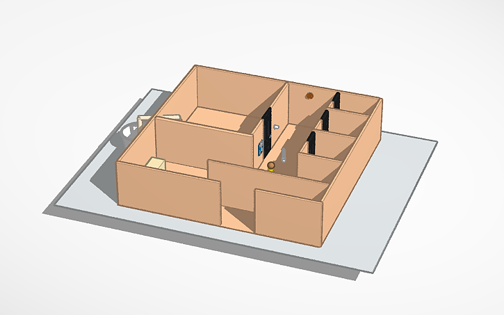

# O-Toilet

o-toilet is an automatic toilet system, where all the systems are fully automatic [(automatic door opening and locking feature), (water feature that fills itself when the water in the tub is empty, this can help reduce water waste for users who misuse it), (LED that lights up according to the conditions)] and is only in the toilet [this is only in the form of a small model or design]

## Example Models

-----------------------------------
THANKYOU 😁